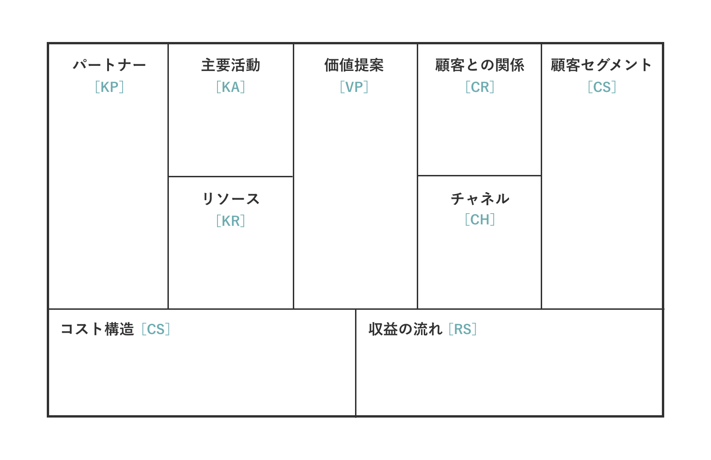

# ビジネスモデルキャンバス Business Model Canvas



## 概要

ビジネスモデルキャンバスとは、事業の構造を「顧客」や「価値提案」といった 9 つの要素で可視化するフレームワーク。ビジネスの全体像を一枚の図で直感的に把握できるため、新規事業の立案や既存事業の分析、チーム内の共通認識を醸成するための強力なツールとして世界中で活用されている。

アレックス・オスターワルダー、イヴ・ピニュールが、2010 年発行の著作『Business Model Generation』（日本語訳『ビジネスモデル・ジェネレーション』、2012 年発行）にて提唱した。両氏はビジネスモデルを「どのように価値を創造し、顧客に届けるかを論理的に記述したもの」と定義し、9 つの要素に分けている。

### 顧客セグメント (CS: Customer Segments)：

同質のニーズを持った顧客群をグループ化し、その中からどのセグメントをターゲットにするのかを記述。

### 価値提案 (VP: Value Propositions)：

ターゲットとした顧客セグメントが持つどのような課題を、どのように解決してニーズを満たすのかを記述。顧客に提供する価値であり、顧客が自社の商品を選ぶ理由でもある。ターゲット顧客が細分化される場合は、それぞれの提供価値を明らかにする。

### チャネル (CH: Channels)：

ターゲットとした顧客セグメントにどのような接点でリーチし、コミュニケーションしたり価値を届けたりするのかを記述。チャネルは「モノの流れ（商品やサービスを提供）」、「カネの流れ（決済等）」、「情報の流れ（広告や販促、クチコミ等）」などがあるが、これらを整理して書く。

### 顧客との関係 (CR: Customer Relationships)：

ターゲットとした顧客セグメントと、どのような関係を構築するかを記述。関係とは「対人なのか、ウェブなのか？」といった接点の種類だけでなく、長さと深さからも考える必要がある。顧客との関係性が長いと、リピートや長期契約によって収益機会が増大する。一人の顧客が生涯で企業にもたらす利益の総額（ライフタイムバリュー：LTV）をいかに最大化するかも検討したい。また顧客との関係性が深いと、他社にスイッチされにくくなるとともに、クチコミ等による宣伝効果も期待できる。

### 収益の流れ (R$:Revenue Streams)：

ターゲットとした顧客は、どのような価値に対して、どれくらい、どのようにお金を払うのかを記述。収益の種別（物販､仲介料、利用料、ライセンス料等）毎に検討する。

### リソース (KR: Key Resources)：

構築しようとしているビジネスモデルは、どのような資源が、どのくらい必要で、どのように調達するのかを記述。資源には、物的資産だけでなく、知的財産や人的リソースも含まれる。すべてを網羅的に記載しようとするのではなく、利益創出や競争優位構築のために鍵となるリソースを明確にする。

### 主要活動 (KA: Key Activities)：

価値を創造し、顧客に届け、維持していく上で重要な活動を記述。価値を提供するための活動とリソースの創出・強化のための活動の 2 つの種類で考える。

### パートナー (KP: Key Partnerships)：

構築しようとしているビジネスモデルには、どのようなパートナーが、どれくらい必要で、どういったアライアンスを組むのかを記述。例えば、自社にないリソースや活動を提供してくれる提携先・仕入先・代理店など。

### コスト構造 (C$: Cost Structure)：

構築しようとしているビジネスモデルを運営していくためには、どのようなコストが、どのくらいかかるのかを記述。ビジネスモデルを実行していくための重要なコスト要素について明らかにするとともに、コスト構造の特徴（変動費と固定費等）に分けて記載しておくと検討がしやすい。

## ビジネスモデル設計のポイント

ビジネスモデルキャンバスはあくまでツールに過ぎない。真に重要なのは、以下の **4 つの問い** に明確に答えることである。これらの問いに答えることが、ビジネスモデル設計の本質となる。

### ① 価値提案（Value Proposition）

**問い: どんな価値を提供するのか？**

- 顧客のどのような課題やニーズに対応するのか
- 競合と比較して、なぜ自社を選ぶべきなのか
- 顧客にとっての具体的なベネフィットは何か
- 該当する要素: **価値提案 (VP)**

### ② マーケティング

**問い: 誰（顧客）を、どうやって獲得し、どんなチャネルを使って価値を届けるか？**

- ターゲット顧客は誰か（顧客セグメントの明確化）
- どのような方法で顧客を獲得するのか（認知、興味喚起、購入促進）
- どのようなチャネルを通じて価値を届けるのか（販売、流通、コミュニケーション）
- 顧客とどのような関係性を構築するのか（取引型 vs 関係型、短期 vs 長期）
- 該当する要素: **顧客セグメント (CS)、チャネル (CH)、顧客との関係 (CR)**

### ③ 価値提供の仕組み

**問い: 誰（パートナー）から原材料やノウハウを仕入れ、自社のどんな経営資源を使って、どんな活動を通じて価値提供するか？**

- どのようなパートナーと協業するのか（サプライヤー、提携先、代理店など）
- 自社のどのような経営資源を活用するのか（人材、技術、ブランド、データなど）
- どのような主要活動を行うのか（生産、開発、マーケティング、サポートなど）
- バリューチェーン全体をどのように設計するのか
- 該当する要素: **パートナー (KP)、リソース (KR)、主要活動 (KA)**

### ④ 利益モデル

**問い: どんな課金方法で売上を生み、どんなコストをコントロールすることで、利益化するか？**

- どのような課金方法を採用するのか（物販、サブスクリプション、仲介手数料、ライセンス料など）
- 顧客はどの価値に対して、どれくらい支払うのか
- 主要なコスト要素は何か（固定費 vs 変動費）
- どのようにコストをコントロールし、収益性を確保するのか
- スケールした際の経済性はどうなるか
- 該当する要素: **収益の流れ (R$)、コスト構造 (C$)**

## 4 つの問いとビジネスモデルキャンバスの関係

9 つの要素は、この 4 つの本質的な問いに答えるための構成要素である：

```
① 価値提案
    ↓
② マーケティング ←→ ③ 価値提供の仕組み
    ↓                      ↓
        ④ 利益モデル
```

- **①価値提案** が中心にあり、これが全ての起点となる
- **②マーケティング** と **③価値提供の仕組み** が、価値提案を実現するための両輪
- **④利益モデル** が、持続可能なビジネスとして成立させるための基盤

## 実務での活用ポイント

1. **まず価値提案から**: 顧客への提供価値を明確にしてから、他の要素を検討する
2. **整合性の確認**: 9 つの要素が相互に矛盾なく連携しているかを検証する
3. **仮説検証**: 各要素は仮説であり、実際の市場で検証し、改善を繰り返す
4. **シンプルさ**: 複雑すぎるビジネスモデルは実行困難。シンプルで明快な設計を心がける
5. **競合分析**: 競合のビジネスモデルキャンバスも作成し、差別化ポイントを明確にする
6. **継続的な更新**: 市場環境の変化に応じて、ビジネスモデルを進化させる
